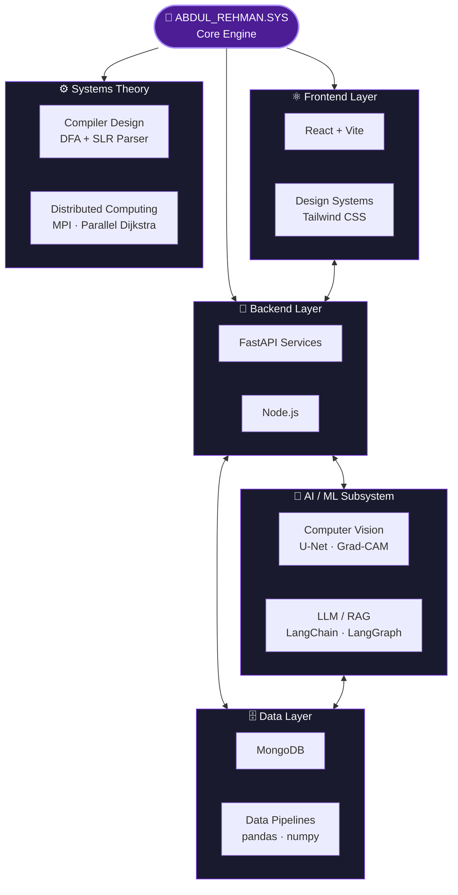
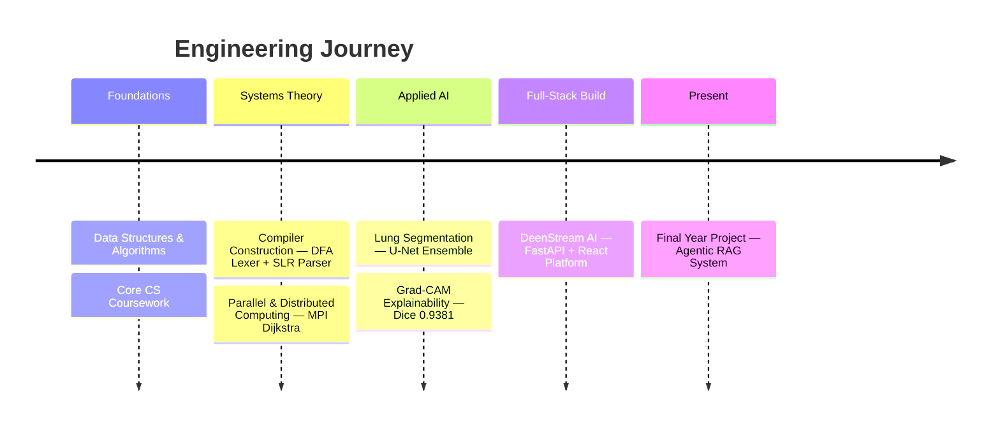

<div align="center">


</div>

```
 █████╗ ██████╗ ██████╗ ██╗   ██╗██╗
██╔══██╗██╔══██╗██╔══██╗██║   ██║██║
███████║██████╔╝██║  ██║██║   ██║██║
██╔══██║██╔══██╗██║  ██║██║   ██║██║
██║  ██║██████╔╝██████╔╝╚██████╔╝███████╗
╚═╝  ╚═╝╚═════╝ ╚═════╝  ╚═════╝ ╚══════╝

██████╗ ███████╗██╗  ██╗███╗   ███╗ █████╗ ███╗   ██╗
██╔══██╗██╔════╝██║  ██║████╗ ████║██╔══██╗████╗  ██║
██████╔╝█████╗  ███████║██╔████╔██║███████║██╔██╗ ██║
██╔══██╗██╔══╝  ██╔══██║██║╚██╔╝██║██╔══██║██║╚██╗██║
██║  ██║███████╗██║  ██║██║ ╚═╝ ██║██║  ██║██║ ╚████║
╚═╝  ╚═╝╚══════╝╚═╝  ╚═╝╚═╝     ╚═╝╚═╝  ╚═╝╚═╝  ╚═══╝
```

<div align="center">


<sub>ABDUL_REHMAN.SYS &nbsp;·&nbsp; kernel 5.26.0-cs-final-year &nbsp;·&nbsp; uptime: still compiling dreams</sub>

</div>

<br/>

```bash
guest@github:~$ whoami
```

> Final-year **Computer Science** undergraduate who treats software like infrastructure — built to run, not just to demo.
> I ship **full-stack platforms**, train **deep learning models** for real diagnostic tasks, and have hand-built a **compiler front-end** and a **parallel graph algorithm** from the ground up, because understanding the machine underneath makes the layers above trustworthy.
> Currently root-privileged on the AI/ML subsystem of a 4-engineer **Final Year Project**, shipping an agentic RAG platform meant to survive contact with real users.

```bash
guest@github:~$ status --open-to
```

<div align="center">


</div>

<br/>

---

### `$ cat /sys/architecture/self.diagram`



---

### `$ timeline --engineering-journey`



---

### `$ htop --filter=proficiency`

```
  PID  MODULE                  PROFICIENCY
 1001  Deep Learning (CV)      ████████████████████░░░░  85%
 1002  Explainable AI          ███████████████████░░░░░  82%
 1003  Full-Stack Engineering  █████████████████████░░░  88%
 1004  Backend / APIs          ██████████████████████░░  90%
 1005  LLM / RAG / Agentic AI  ██████████████████░░░░░░  76%
 1006  Compiler Theory         █████████████████░░░░░░░  72%
 1007  Distributed Systems     ████████████████░░░░░░░░  68%

Tasks: 7 modules,  7 running,  0 zombie   |   Load average: focused, focused, shipping
```

---

### `$ cat docker-compose.yml`

```yaml
version: "engineer-3.9"
services:

  frontend:
    image: react-vite:latest
    stack: [react, vite, javascript, typescript, tailwindcss, html, css]

  backend:
    image: fastapi:latest
    stack: [python, fastapi, nodejs]
    ports: ["reliable:always"]

  ai-engine:
    image: pytorch-tensorflow:latest
    stack: [pytorch, tensorflow, scikit-learn, opencv, pandas]
    depends_on: [backend]

  database:
    image: mongodb:latest
    stack: [mongodb]
    depends_on: [backend]

  devops:
    image: engineering-tools:latest
    stack: [git, github, docker, vscode, vercel, kaggle, postman]

  systems:
    image: theory-and-c:latest
    stack: [c, cpp, mpi, automata-theory]
```

---

### `$ git log --oneline --graph --all`

```text
* a1b2c3d (HEAD -> main) feat: lead AI/ML track — Final Year Project, agentic RAG platform
* 9f8e7d6 feat: architect DeenStream AI — full-stack Islamic content platform, solo build
* 5c4b3a2 research: lung segmentation ensemble (U-Net + VGG16) — Dice score 0.9381
* 2d1e0f9 build: SLR parser + minimized DFA lexer, compiler construction from scratch
* 7b6a5c4 research: MPI-based parallel Dijkstra — distributed routing convergence
* 3f2e1d0 init: began Computer Science undergraduate journey
```

<br/>

<div align="center">


</div>

### `$ ls -la ~/projects/`

```text
drwxr-xr-x  deenstream-ai/          full-stack islamic content platform
drwxr-xr-x  lung-segmentation-xai/  deep learning · explainable ai
drwxr-xr-x  slr-parser-compiler/    compiler construction, built from scratch
drwxr-xr-x  mpi-parallel-dijkstra/  distributed computing
```

<details>
<summary><code>$ man deenstream-ai</code></summary>
<br/>

**DEENSTREAM-AI(1)** — full-stack Islamic content platform

A production-grade Islamic knowledge platform combining structured content delivery with an AI-powered assistant, architected and shipped independently end-to-end.

| Field | Value |
|:---|:---|
| **STACK** | FastAPI · Vite + React · Gemini API · REST |
| **MODULES** | Quran reader · Hadith browser · Prayer Times · Duas · 99 Names · AI Chat |
| **PERFORMANCE** | Async FastAPI endpoints, optimized client-side rendering via Vite |
| **SECURITY** | Environment-scoped API keys, gateway-isolated LLM access |
| **IMPACT** | Unified, ad-free access point for core Islamic knowledge resources |
| **REPO** | [github.com/TechWithAbdul](https://github.com/TechWithAbdul) |

**DESCRIPTION**
Decoupled frontend/backend system — FastAPI handles content delivery and Gemini-powered AI chat, React handles UX. Solved real integration bugs including AI gateway routing and settings resolution to keep model responses reliable in production.

</details>

<details>
<summary><code>$ man lung-segmentation-xai</code></summary>
<br/>

**LUNG-SEGMENTATION-XAI(1)** — deep learning pipeline with explainability

Automated lung segmentation from chest X-rays, combining ensemble deep learning with Grad-CAM interpretability.

| Field | Value |
|:---|:---|
| **STACK** | Python · TensorFlow/Keras · U-Net · VGG16 Transfer Learning · Kaggle |
| **ARCHITECTURE** | Dual ensemble — Baseline U-Net + VGG16 U-Net |
| **RESULT** | Best Dice score: **0.9381** |
| **RESILIENCE** | Three-tier history recovery, multi-candidate dataset path resolution |
| **IMPACT** | Interpretable segmentation output via Grad-CAM for clinical explainability |
| **REPO** | [github.com/TechWithAbdul](https://github.com/TechWithAbdul) |

**DESCRIPTION**
Built a training pipeline resilient to Kaggle session resets. A hard shape-assertion caught a critical VGG16 decoder bug before it silently corrupted results — the kind of bug that only surfaces under real training load.

</details>

<details>
<summary><code>$ man slr-parser-compiler</code></summary>
<br/>

**SLR-PARSER-COMPILER(1)** — compiler front-end from first principles

A two-phase compiler front-end for a loop-statement subset of a programming language, built without external parser generators.

| Field | Value |
|:---|:---|
| **STACK** | Python · DFA · LR(0) Automaton · SLR Parsing |
| **SCALE** | 21-state minimized DFA · 10-production CFG · full FIRST/FOLLOW/ACTION-GOTO tables |
| **VALIDATION** | Stack-based shift-reduce parser, 7/7 test cases passing |
| **IMPACT** | Complete lexer → parser pipeline understood and implemented by hand |
| **REPO** | [github.com/TechWithAbdul](https://github.com/TechWithAbdul) |

**DESCRIPTION**
Phase 1 built a minimized-DFA lexer with a 21×21 transition table. Phase 2 extended it into a full SLR parser, constructing the LR(0) automaton and parse tables manually to understand compiler internals at the transition-table level.

</details>

<details>
<summary><code>$ man mpi-parallel-dijkstra</code></summary>
<br/>

**MPI-PARALLEL-DIJKSTRA(1)** — distributed shortest-path routing

An MPI-based parallel implementation of Dijkstra's algorithm for routing convergence, targeting large-scale graph performance.

| Field | Value |
|:---|:---|
| **STACK** | C/C++ · MPI · Parallel Algorithms |
| **ARCHITECTURE** | Master-worker parallel model, distributed across compute nodes |
| **PERFORMANCE** | Reduced convergence time via message-passing parallelization |
| **IMPACT** | Scalable routing computation for network-scale graphs (OSPF/BGP context) |
| **REPO** | [github.com/TechWithAbdul](https://github.com/TechWithAbdul) |

**DESCRIPTION**
Proposed and implemented an MPI parallelization strategy for Dijkstra's algorithm, minimizing inter-node communication overhead while preserving correctness of routing convergence.

</details>

<br/>

---

### `$ systemctl status abdulrehman.services`

```text
● fyp-ai-lead.service           active (running)   Leading AI/ML — 4-member Final Year Project team
● deenstream-ai.service         active (running)   Independent full-stack build, shipped solo
● lung-segmentation.service     exited (success)    Ensemble U-Net + Grad-CAM XAI pipeline — Dice 0.9381
● compiler-theory.service       exited (success)    DFA lexer + SLR parser, built from scratch
```

---

### `$ crontab -l`

```bash
# ┌─ learning ───────────────────────────────────────────────
*/1 * * * *   study    agentic-ai langgraph-orchestration rag-architectures

# ┌─ building ───────────────────────────────────────────────
*/1 * * * *   ship     fyp-agentic-platform deenstream-ai

# ┌─ exploring ──────────────────────────────────────────────
@daily        research explainable-ai distributed-systems llm-finetuning

# ┌─ always ─────────────────────────────────────────────────
@reboot       accept   ai-ml-roles fullstack-roles research-collabs internships-2026
```

---

<div align="center">


### `$ curl -s telemetry.abdulrehman.dev/dashboard`


<br/><br/>


<br/>


<br/><br/>


</div>

---

### `$ ifconfig contact0`

```text
contact0: flags=UP,RUNNING,BROADCAST  mtu 1500
        inet   email     ar5431980@gmail.com
        inet   linkedin  linkedin.com/in/abdulrehman90
        inet   github    github.com/TechWithAbdul
        status: socket open — accepting connections
```

<div align="center">


</div>

---

```bash
guest@github:~$ shutdown -h now

Broadcast message from abdulrehman@github (pts/0):
System going down for a rebuild — always compiling the next thing.
Connection to abdulrehman closed.
```

<div align="center">

<sub><i>"Code is the closest thing we have to magic — write it with intention."</i></sub>


</div>
