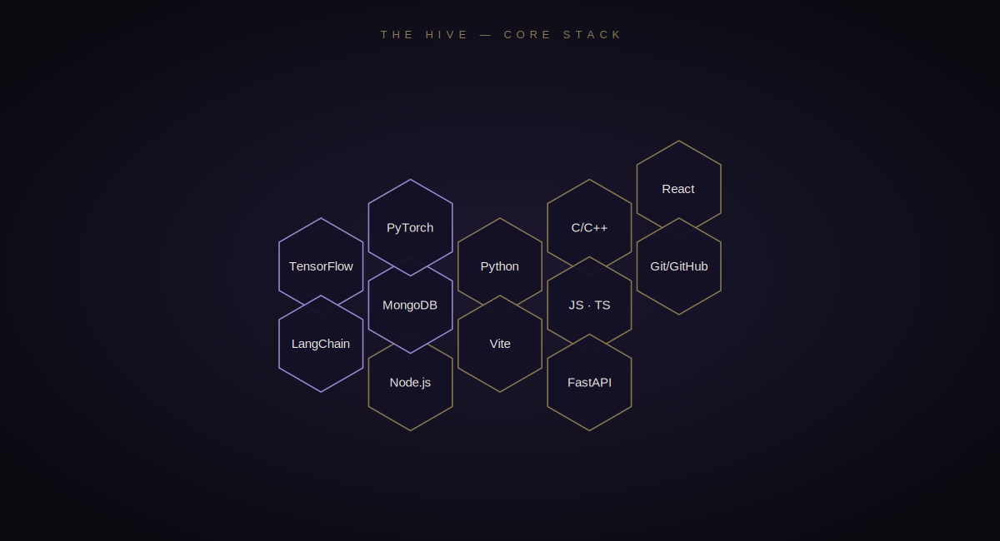

 

<i>Every good profile has a hook. Mine has one that moves.</i>

Final-year Computer Science engineer working across <b>applied AI</b> and <b>full-stack product engineering</b> — 
shipping platforms solo, training models with defensible results, and building the theory 
underneath (compilers, distributed systems) by hand, not by tutorial.

 

`🎓 Computer Science — Final Year`  ·  `📍 Punjab, Pakistan`  ·  `🎯 Open to AI/ML & Full-Stack roles`

 

 

 

 

<h3 align="center">Selected Work</h3>

 

<table align="center" width="100%">
<tr>
<td width="50%" valign="top">

**🕌 DeenStream AI**
Full-stack Islamic content platform — architected and shipped solo. FastAPI backend serving Quran, Hadith, prayer times, duas and a Gemini-powered AI assistant, behind a custom-designed React + Vite frontend.

`FastAPI` `React` `Vite` `Gemini API`

</td>
<td width="50%" valign="top">

**🫁 Lung Segmentation & XAI**
Ensemble deep learning for chest X-ray segmentation — U-Net + VGG16 transfer learning, made interpretable with Grad-CAM. Best Dice score: **0.9381**.

`TensorFlow` `Keras` `U-Net` `Grad-CAM`

</td>
</tr>
<tr>
<td width="50%" valign="top">

**🔁 SLR Parser & Lexer**
A compiler front-end built from first principles — 21-state minimized DFA lexer feeding a hand-built SLR parser, full FIRST/FOLLOW sets and LR(0) automaton, zero parser generators.

`Python` `Automata Theory` `Compiler Design`

</td>
<td width="50%" valign="top">

**⚡ MPI Parallel Dijkstra**
A master-worker MPI implementation of Dijkstra's algorithm, built to study routing convergence across large distributed network graphs.

`C/C++` `MPI` `Distributed Systems`

</td>
</tr>
</table>

 

 

<h3 align="center">Experience</h3>

 

<b>AI/ML Lead</b> · Final Year Project · <i>2025 — Present</i>  
Leading the AI/ML architecture for a four-person engineering team, building an agentic, 
RAG-powered platform on LangChain and LangGraph — engineered for real deployment, 
not a one-off demo.

`LangChain` `LangGraph` `FastAPI` `MongoDB` `React`

 

 

<h3 align="center">GitHub Signal</h3>

  

 

 

<h3 align="center">The Trail Was Real</h3>

every green square below is one it actually crawled through

 

 

<h3 align="center">Let's Connect</h3>

[Email](mailto:ar5431980@gmail.com) &nbsp;·&nbsp; [LinkedIn](https://www.linkedin.com/in/abdulrehman90/) &nbsp;·&nbsp; [GitHub](https://github.com/TechWithAbdul)

 

