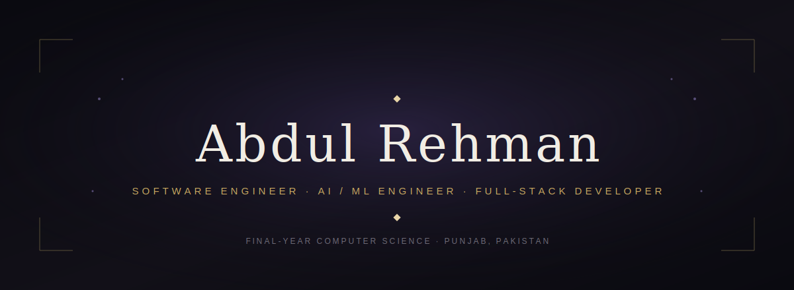

 

 

<i>I build software the way I'd want to inherit it — clear architecture, honest documentation, 
and systems that still make sense six months later.</i>

Final-year Computer Science student who moves comfortably between <b>full-stack product engineering</b> 
and <b>applied AI research</b> — from shipping a complete platform solo to training deep learning 
models with measurable, defensible results.

 

`🎓 Computer Science — Final Year`   ·   `📍 Punjab, Pakistan`   ·   `🎯 Open to AI/ML & Full-Stack roles`

 

 

<h3 align="center">Core Expertise</h3>

**Languages**
 

  

**Full-Stack**
 

  

**AI / ML**
 

  

**Data & Tooling**
 

 

 

<h3 align="center">Selected Work</h3>

 

**🕌 DeenStream AI** — Full-stack Islamic content platform
Designed and shipped solo: a FastAPI backend serving Quran, Hadith, prayer times, duas and a Gemini-powered AI assistant, paired with a custom-designed React + Vite frontend.
`FastAPI` `React` `Vite` `Gemini API`

 

**🫁 Lung Segmentation & XAI** — Deep learning for medical imaging
An ensemble of U-Net and VGG16-transfer-learning architectures for chest X-ray segmentation, made interpretable with Grad-CAM. Best Dice score: **0.9381**.
`TensorFlow` `Keras` `U-Net` `Grad-CAM`

 

**🔁 SLR Parser & Lexer** — Compiler built from first principles
A 21-state minimized DFA lexer feeding a hand-built SLR parser — full FIRST/FOLLOW sets, LR(0) automaton, and a working shift-reduce parser, no parser generator involved.
`Python` `Automata Theory` `Compiler Design`

 

**⚡ MPI Parallel Dijkstra** — Distributed routing at scale
A master-worker MPI implementation of Dijkstra's algorithm, built to study routing convergence in large network graphs.
`C/C++` `MPI` `Distributed Systems`

 

 

<h3 align="center">Experience</h3>

 

**AI/ML Lead** · Final Year Project — *2025 to Present*
Leading the AI/ML architecture for a four-person engineering team, building an agentic, RAG-powered platform with LangChain and LangGraph, engineered for real deployment rather than a one-off demo.
`LangChain` `LangGraph` `FastAPI` `MongoDB` `React`

 

 

<h3 align="center">GitHub Snapshot</h3>

  

 

 

<h3 align="center">Let's Connect</h3>

[Email](mailto:ar5431980@gmail.com) &nbsp;·&nbsp; [LinkedIn](https://www.linkedin.com/in/abdulrehman90/) &nbsp;·&nbsp; [GitHub](https://github.com/TechWithAbdul)

 

