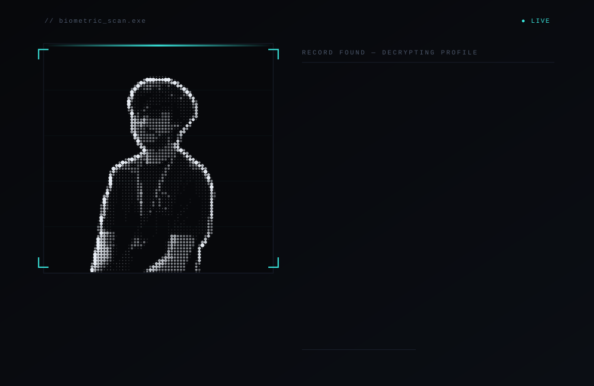

<div align="center">



</div>

<br/>

<h3 align="center"><code>$ cat about.md</code></h3>

<p align="center">
Full-Stack Web Developer, currently pursuing AI Engineering.<br/>
Final-year Computer Science student who treats coursework as a starting point, not the destination —<br/>
what began as core CS theory has grown into shipping real software: full-stack platforms,<br/>
deep learning pipelines, and a compiler built by hand.
</p>

<div align="center">

`🎓 Computer Science — Final Year`  ·  `📍 Punjab, Pakistan`  ·  `🎯 Open to AI/ML & Full-Stack roles`

</div>

<br/>

<p align="center"><sub>// ─────────────────────────────────────────────────────────────────── //</sub></p>

<h3 align="center"><code>$ ls ./stack --icons</code></h3>

<br/>

<p align="center"><sub><b>LANGUAGES</b></sub></p>
<div align="center">

</div>

<br/>

<p align="center"><sub><b>FULL-STACK</b></sub></p>
<div align="center">

</div>

<br/>

<p align="center"><sub><b>AI / ML</b></sub></p>
<div align="center">

</div>

<br/>

<p align="center"><sub><b>DATA &amp; TOOLING</b></sub></p>
<div align="center">

</div>

<br/>

<p align="center"><sub>// ─────────────────────────────────────────────────────────────────── //</sub></p>

<h3 align="center"><code>$ ls ./projects -la</code></h3>

<br/>

**🕌 DeenStream AI** &nbsp; <sub>`STATUS: DEPLOYED SOLO`</sub>
Full-stack Islamic content platform — architected and shipped end-to-end by me. FastAPI backend serving Quran, Hadith, prayer times, and a Gemini-powered AI assistant, behind a custom-designed React + Vite frontend.
`FastAPI` `React` `Vite` `Gemini API`

**🫁 Lung Segmentation & XAI** &nbsp; <sub>`STATUS: DICE 0.9381`</sub>
Ensemble deep learning (U-Net + VGG16 transfer learning) for chest X-ray segmentation, made interpretable with Grad-CAM.
`TensorFlow` `Keras` `U-Net` `Grad-CAM`

**🔁 SLR Parser & Lexer** &nbsp; <sub>`STATUS: 7/7 TESTS PASS`</sub>
A compiler front-end built from first principles: 21-state minimized DFA lexer feeding a hand-built SLR parser, full FIRST/FOLLOW sets and LR(0) automaton, zero parser generators.
`Python` `Automata Theory` `Compiler Design`

**⚡ MPI Parallel Dijkstra** &nbsp; <sub>`STATUS: RESEARCH COMPLETE`</sub>
A master-worker MPI implementation of Dijkstra's algorithm, built to study routing convergence across large distributed network graphs.
`C/C++` `MPI` `Distributed Systems`

<br/>

<p align="center"><sub>// ─────────────────────────────────────────────────────────────────── //</sub></p>

<h3 align="center"><code>$ crontab -l</code></h3>

<br/>

```bash
# ┌─ learning ─────────────────────────────────────────────
*/1 * * * *   study    agentic-ai langgraph-orchestration rag-architectures

# ┌─ building ─────────────────────────────────────────────
*/1 * * * *   ship     deenstream-ai

# ┌─ exploring ────────────────────────────────────────────
@daily        research explainable-ai distributed-systems

# ┌─ always ───────────────────────────────────────────────
@reboot       accept   ai-ml-roles fullstack-roles internships-2026
```

<br/>

<p align="center"><sub>// ─────────────────────────────────────────────────────────────────── //</sub></p>

<h3 align="center"><code>curl api.github.com/users/TechWithAbdul</code></h3>

<div align="center">


<br/><br/>


</div>

<br/>

<p align="center"><sub>// ─────────────────────────────────────────────────────────────────── //</sub></p>

<h3 align="center"><code>$ contact --open</code></h3>

<div align="center">

<a href="mailto:ar5431980@gmail.com"></a>
<a href="https://www.linkedin.com/in/abdulrehman90/"></a>
<a href="https://github.com/TechWithAbdul"></a>

</div>

<br/>

<div align="center">

```
$ logout
Connection to abdulrehman closed.
```

</div>
