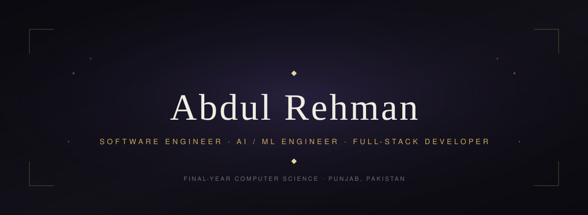

 

<h3 align="center">About</h3>

I'm a final-year Computer Science student who treats coursework as a starting point, not the destination. 
What began as core CS theory — data structures, algorithms, systems — has grown into shipping 
real software: full-stack platforms, deep learning pipelines, and a compiler built by hand.

Right now I'm leading the <b>AI/ML architecture</b> for a four-person Final Year Project team, building an 
agentic, RAG-powered platform designed to actually be deployed — not just demoed and forgotten. 
I care about the same thing whether I'm training a model or shipping a frontend: does it hold up 
when a real person uses it.

`🎓 Computer Science — Final Year`  ·  `📍 Punjab, Pakistan`  ·  `🎯 Open to AI/ML & Full-Stack roles`

 

---

<h3 align="center">Tech Stack</h3>

 

<b>LANGUAGES</b>

 

<b>FULL-STACK</b>

 

<b>AI / ML</b>

 

<b>DATA &amp; TOOLING</b>

 

---

<h3 align="center">Selected Work</h3>

 

**🕌 DeenStream AI** — Full-stack Islamic content platform, architected and shipped solo. FastAPI backend serving Quran, Hadith, prayer times, and a Gemini-powered AI assistant, behind a custom-designed React + Vite frontend.
`FastAPI` `React` `Vite` `Gemini API`

**🫁 Lung Segmentation & XAI** — Ensemble deep learning (U-Net + VGG16 transfer learning) for chest X-ray segmentation, made interpretable with Grad-CAM. Best Dice score: **0.9381**.
`TensorFlow` `Keras` `U-Net` `Grad-CAM`

**🔁 SLR Parser & Lexer** — A compiler front-end built from first principles: 21-state minimized DFA lexer feeding a hand-built SLR parser, full FIRST/FOLLOW sets and LR(0) automaton, zero parser generators.
`Python` `Automata Theory` `Compiler Design`

**⚡ MPI Parallel Dijkstra** — A master-worker MPI implementation of Dijkstra's algorithm, built to study routing convergence across large distributed network graphs.
`C/C++` `MPI` `Distributed Systems`

 

---

<h3 align="center">Experience</h3>

 

<b>AI/ML Lead</b> · Final Year Project · <i>2025 — Present</i> 
Leading the AI/ML architecture for a four-person engineering team, building an agentic, 
RAG-powered platform on LangChain and LangGraph — engineered for real deployment, 
not a one-off demo.

`LangChain` `LangGraph` `FastAPI` `MongoDB` `React`

 

---

<h3 align="center">GitHub</h3>

 

---

<h3 align="center">Let's Connect</h3>

[Email](mailto:ar5431980@gmail.com) &nbsp;·&nbsp; [LinkedIn](https://www.linkedin.com/in/abdulrehman90/) &nbsp;·&nbsp; [GitHub](https://github.com/TechWithAbdul)

